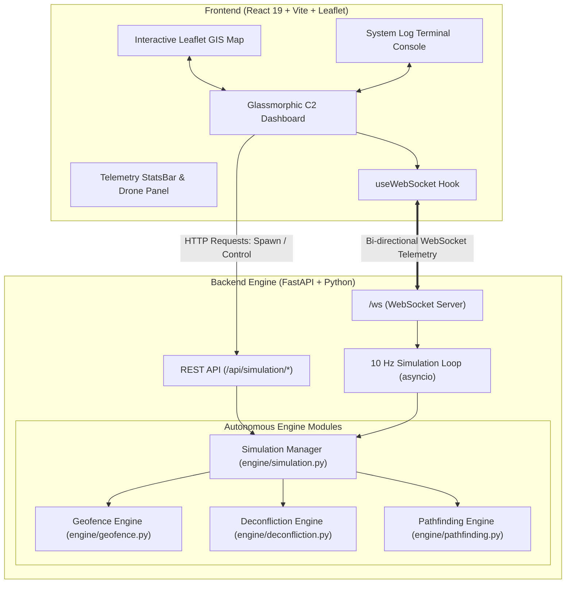

# AkashSetu (आकाशसेतु) 🛸
### Next-Generation Real-Time Unmanned Aircraft System Traffic Management (UTM) & Autonomous Deconfliction Platform

[](https://fastapi.tiangolo.com/)
[](https://python.org)
[](https://react.dev/)
[](https://vitejs.dev/)
[](https://leafletjs.com/)
[](https://developer.mozilla.org/en-US/docs/Web/API/WebSockets_API)

---

## 📌 Table of Contents
- [Overview](#-overview)
- [Key Features](#-key-features)
- [System Architecture](#-system-architecture)
- [Implementation Details & Core Modules](#-implementation-details--core-modules)
  - [1. Geofencing & Safety Buffer Enforcer](#1-geofencing--safety-buffer-enforcer)
  - [2. Dynamic Virtual Zone Merging](#2-dynamic-virtual-zone-merging)
  - [3. Autonomous Convex Arc Pathfinding](#3-autonomous-convex-arc-pathfinding)
  - [4. Real-Time 3D Deconfliction](#4-real-time-3d-deconfliction)
  - [5. 10Hz Physics & Telemetry Engine](#5-10hz-physics--telemetry-engine)
- [Frontend Command & Control Dashboard](#-frontend-command--control-dashboard)
- [Data Flow & Lifecycle](#-data-flow--lifecycle)
- [Getting Started](#-getting-started)
  - [Prerequisites](#prerequisites)
  - [Backend Setup](#backend-setup)
  - [Frontend Setup](#frontend-setup)
- [API & WebSocket Specification](#-api--websocket-specification)
- [Directory Structure](#-directory-structure)

---

## 📖 Overview

**AkashSetu** (*"Sky Bridge"*) is a high-performance **Unmanned Aircraft System Traffic Management (UTM)** platform engineered for dense urban low-altitude airspace. It provides real-time situational awareness, autonomous 3D multi-drone deconfliction, dynamic geofence enforcement with automated safety buffers, and instant obstacle-avoidance trajectory recalculation.

Designed to address BVLOS (Beyond Visual Line of Sight) drone operations, AkashSetu continuously monitors the airspace at **10 Hz**, streams synchronized telemetry via low-latency WebSockets, and offers a glassmorphism Command & Control (C2) dashboard.

---

## ✨ Key Features

- **🚀 Sub-100ms 10Hz Telemetry Streaming**: Real-time broadcast of all drone 3D coordinates, headings, velocities, trajectories, and system status via bi-directional WebSockets.
- **🛡️ 3D Tactical Deconfliction**: Automatic detection of horizontal (<200m warning, <100m danger) and vertical (<30ft) collision vectors with instant lateral evasion and altitude tiering.
- **🌐 Proactive Geofence Enforcement**:
  - **Red Zones**: Strict No-Fly Zones (airports, defense areas, sensitive corridors).
  - **Yellow Zones**: 200m dynamic safety buffer rings surrounding restricted airspaces.
  - **Virtual Merged Zones**: Automatic clustering and single convex bounding envelope generation for nearby restricted zones to prevent drones from entering hazardous choke points.
- **🗺️ Convex Arc Pathfinding**: Pre-computes smooth, flyable bypass corridors around restricted airspace maintaining a minimum 300m clearance margin.
- **📍 Interactive Click-to-Pin Drone Dispatch**: Add custom flights by directly pinning origin and destination points on the interactive Leaflet GIS map.
- **📊 Real-Time Telemetry HUD & Terminal Log**: Live tracking of active flights, averted collisions, geofence breaches, safety reroutes, and structured searchable system logs.
- **⚡ Simulation Speed Control**: Seamlessly adjust simulation speed between **1x to 30x** or pause/resume live physics without connection drops.

---

## 🏛️ System Architecture



---

## 🧠 Implementation Details & Core Modules

### 1. Geofencing & Safety Buffer Enforcer
**File**: [`backend/engine/geofence.py`](file:///d:/Coding/Projects/SIH/akashsetu/backend/engine/geofence.py)
- **Zone Classification**: Categorizes airspace into `RED` (Strict No-Fly, e.g., IGI Airport, Rashtrapati Bhavan, NSA Complex), `YELLOW` (Restricted / Caution), and `GREEN` (Unrestricted).
- **Safety Buffers**: Automatically expands all restricted zones by **200 meters (`SAFETY_BUFFER_M = 200.0`)**.
- **Haversine Distance & Shapely Polygons**: Uses spherical trigonometry and Euclidean planar projections to determine whether a drone point or trajectory segment intersects a restricted zone or its safety perimeter.

### 2. Dynamic Virtual Zone Merging
**File**: [`backend/engine/geofence.py`](file:///d:/Coding/Projects/SIH/akashsetu/backend/engine/geofence.py)
- When two or more restricted zones are within **600 meters** of each other (`MERGE_CLUSTER_THRESHOLD_M = 600.0`), individual bypass paths through the narrow gap become dangerous.
- AkashSetu clusters these zones and computes a single **`VirtualMergedZone`** (an enclosing circle that encompasses both zones plus their buffers), forcing the pathfinder to route around the entire complex safely.

### 3. Autonomous Convex Arc Pathfinding
**File**: [`backend/engine/pathfinding.py`](file:///d:/Coding/Projects/SIH/akashsetu/backend/engine/pathfinding.py)
- Computes flight corridors from source to destination.
- When the straight-line trajectory intersects an obstacle or safety buffer, the pathfinder generates a multi-point convex arc detour around the perimeter with an additional clearance margin (`PATH_CLEARANCE_MARGIN_M = 300.0`).
- Selects the shortest path between clockwise and counter-clockwise bypass options.

### 4. Real-Time 3D Deconfliction
**File**: [`backend/engine/deconfliction.py`](file:///d:/Coding/Projects/SIH/akashsetu/backend/engine/deconfliction.py)
- Evaluates pairwise proximity matrices across all active drones every tick:
  - **Horizontal Warning**: `200m`
  - **Horizontal Danger**: `100m`
  - **Vertical Safe Separation**: `30ft`
- **Resolution Tactics**:
  - **Altitude Tiering**: If two drones are on a collision course at the same altitude, the drone with the lower ID increases altitude by `+50 ft` while the other descends or maintains level.
  - **Speed Regulation**: Applies a `0.7x` speed reduction factor to the trailing drone.
  - **Lateral Offsetting**: Dynamically applies orthogonal offset vectors to divert headings.

### 5. 10Hz Physics & Telemetry Engine
**File**: [`backend/engine/simulation.py`](file:///d:/Coding/Projects/SIH/akashsetu/backend/engine/simulation.py)
- Runs an asynchronous event loop at **10 ticks per second** (`dt = 0.1s`).
- Advances drone positions along trajectories, computes instant bearings, smooths waypoint transitions, handles take-offs, rerouting, and landings.
- Emits structured `SystemLogEntry` records (`INFO`, `CAUTION`, `WARNING`, `CRITICAL`, `SUCCESS`) across categories: `GEOFENCE`, `CONFLICT`, `FLIGHT`, `REROUTE`, `SYSTEM`.

---

## 🖥️ Frontend Command & Control Dashboard

Built with **React 19** and custom modern CSS design:

- **HUD Stats Bar** ([`StatsBar.jsx`](file:///d:/Coding/Projects/SIH/akashsetu/frontend/src/components/StatsBar.jsx)):
  - Active Drones count, Total Flights, Collisions Averted counter, Geofence Violations, Safety Reroutes, and System Uptime clock.
- **Interactive GIS Map** ([`MapView.jsx`](file:///d:/Coding/Projects/SIH/akashsetu/frontend/src/components/MapView.jsx)):
  - Dark-mode OpenStreetMap tiles with custom SVG drone markers rotating dynamically with compass heading.
  - Color-coded altitude scaling and glowing path polylines (Original vs. Rerouted paths).
  - Visual Red Zones, Yellow Safety Buffer Rings, and dashed Virtual Merged Zone perimeters.
  - Interactive map-click coordinate capture for instant drone dispatch.
- **Simulation Control Panel** ([`ControlPanel.jsx`](file:///d:/Coding/Projects/SIH/akashsetu/frontend/src/components/ControlPanel.jsx)):
  - Global Flight Initiator (spawns multi-operator drone traffic).
  - Play/Pause toggle and speed slider (1x – 30x).
  - Drone Inspector: Real-time telemetry inspect drawer (altitude, speed, heading, progress %, coordinates).
- **System Log Console** ([`SystemLogConsole.jsx`](file:///d:/Coding/Projects/SIH/akashsetu/frontend/src/components/SystemLogConsole.jsx)):
  - Real-time streaming log terminal with log level filters, search query filtering, autoscroll, and JSON export.

---

## 🔄 Data Flow & Lifecycle

```text
[User / Simulation Init]
          │
          ▼
1. Path Planner pre-calculates safe waypoints avoiding Red Zones & Virtual Clusters
          │
          ▼
2. 10Hz Simulation Engine advances drone positions via Kinematics
          │
          ▼
3. Geofence Enforcer verifies 200m buffer clearance
          │
          ├──> [Buffer Breached] ──> Auto-Reroute via Convex Arc Bypass
          │
          ▼
4. Deconfliction Matrix tests all pairwise distances
          │
          ├──> [Conflict Detected (<100m)] ──> Altitude Shift (±50ft) & Speed Modulation
          │
          ▼
5. Telemetry Packet aggregated (Drones, Zones, Logs, Stats)
          │
          ▼
6. Streamed via WebSocket (/ws) to Frontend C2 Dashboard
          │
          ▼
7. React-Leaflet Map & UI HUD render real-time positions & alerts
```

---

## 🚀 Getting Started

### Prerequisites
- **Python 3.10+**
- **Node.js 18+** & **npm**

---

### Backend Setup

1. **Navigate to the backend directory**:
   ```powershell
   cd backend
   ```

2. **Create and activate a virtual environment** *(recommended)*:
   ```powershell
   python -m venv venv
   .\venv\Scripts\Activate.ps1   # On Windows
   # source venv/bin/activate     # On Linux / macOS
   ```

3. **Install Python dependencies**:
   ```powershell
   pip install -r requirements.txt
   ```

4. **Start the FastAPI backend server**:
   ```powershell
   uvicorn main:app --reload --port 8000
   ```
   *The backend will start at `http://localhost:8000` (API Docs at `http://localhost:8000/docs`).*

---

### Frontend Setup

1. **Navigate to the frontend directory**:
   ```powershell
   cd frontend
   ```

2. **Install Node modules**:
   ```powershell
   npm install
   ```

3. **Start the Vite development server**:
   ```powershell
   npm run dev
   ```
   *Open your browser and navigate to `http://localhost:5173`.*

---

## 📡 API & WebSocket Specification

### WebSocket Endpoint: `ws://localhost:8000/ws`
Streams real-time updates every 100ms.

**Incoming Client Commands**:
```json
{ "type": "set_speed", "value": 15.0 }
{ "type": "toggle_pause" }
{ "type": "ping" }
```

**Outgoing Telemetry Payload**:
```json
{
  "type": "telemetry",
  "drones": [
    {
      "id": "DRN-E4A102",
      "operator": "Garuda Aerospace",
      "operator_color": "#00E5FF",
      "lat": 28.6139,
      "lng": 77.2090,
      "altitude": 150.0,
      "speed": 55.0,
      "heading": 84.2,
      "status": "in_flight",
      "progress": 0.42,
      "warning_level": 0,
      "trajectory": [...]
    }
  ],
  "zones": [...],
  "virtual_zones": [...],
  "logs": [...],
  "stats": {
    "active_drones": 12,
    "total_drones": 12,
    "completed_drones": 0,
    "collisions_averted": 4,
    "geofence_violations": 0,
    "safety_reroutes": 6,
    "active_warnings": 1,
    "uptime_seconds": 124.5
  }
}
```

### REST API Endpoints

| Method | Endpoint | Description |
|---|---|---|
| `GET` | `/api/zones` | Returns all restricted Red and Yellow zones |
| `GET` | `/api/virtual-zones` | Returns computed dynamic virtual merged zones |
| `GET` | `/api/drones` | Returns state of all active drones |
| `POST` | `/api/drones` | Dispatches a new drone with custom origin/destination |
| `POST` | `/api/simulation/initiate` | Spawns a multi-drone urban flight scenario (10-14 drones) |
| `POST` | `/api/simulation/reset` | Clears all active flights and resets metrics |
| `POST` | `/api/simulation/pause` | Pauses or resumes simulation execution |
| `POST` | `/api/simulation/speed` | Sets simulation multiplier (`1.0` to `30.0`) |
| `GET` | `/api/simulation/stats` | Returns current aggregate system statistics |

---

## 📁 Directory Structure

```text
akashsetu/
├── README.md                  # Comprehensive Project Documentation
├── backend/                   # FastAPI Backend Server & UTM Engine
│   ├── main.py                # Server entry point, REST endpoints & WebSocket handler
│   ├── requirements.txt       # Python package dependencies
│   ├── models/
│   │   ├── __init__.py
│   │   └── drone.py           # Pydantic schemas (DroneState, RestrictedZone, Logs, Telemetry)
│   └── engine/
│       ├── __init__.py
│       ├── deconfliction.py   # Pairwise collision detection & 3D avoidance tactics
│       ├── geofence.py        # Geofence boundaries, 200m buffers, virtual zone clustering
│       ├── pathfinding.py     # Convex arc rerouting & clearance corridor calculations
│       └── simulation.py      # 10Hz physics loop, drone kinematics & state manager
│
└── frontend/                  # React 19 + Vite C2 Frontend
    ├── index.html
    ├── package.json
    ├── vite.config.js
    └── src/
        ├── main.jsx
        ├── App.jsx            # Main app coordinator & state management
        ├── App.css
        ├── index.css          # Design system, glassmorphic theme & layout tokens
        ├── hooks/
        │   └── useWebSocket.js # Real-time resilient WebSocket hook with auto-reconnect
        └── components/
            ├── AddDroneModal.jsx      # Modal for custom flight dispatch & click-to-pin
            ├── AddDroneModal.css
            ├── AlertFeed.jsx          # Collapsible alert notifications drawer
            ├── AlertFeed.css
            ├── ControlPanel.jsx       # Flight initiator, speed slider & drone list
            ├── ControlPanel.css
            ├── MapView.jsx            # Leaflet 2D/3D GIS visualization & drone markers
            ├── MapView.css
            ├── StatsBar.jsx           # Top telemetry HUD bar with live counters
            ├── StatsBar.css
            ├── SystemLogConsole.jsx   # Streaming terminal console with filtering
            └── SystemLogConsole.css
```

---

## 👥 Authors & Acknowledgments

- **AkashSetu Team** - Smart India Hackathon (SIH)
- Built for safe, autonomous, and scalable integration of drones into sovereign airspace.
